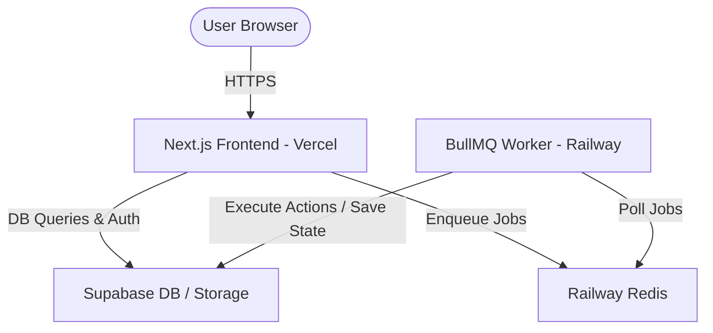

# Production Deployment Plan - SoloSpider AI

This document provides a step-by-step blueprint for deploying the SoloSpider AI stack to production using **Supabase** (Database/Storage), **Railway** (Redis & Background Worker), and **Vercel** (Next.js Frontend).

---

## Architecture Overview



---

## Phase 1: Supabase Setup (Database & Storage)

Your database schema and storage policies are already configured locally. Follow these steps to push them to production:

### 1. Database Migrations
Since you have already authenticated the Supabase CLI using your access token, you can deploy your local database migrations directly to your production project:
```bash
# Verify your local config points to the correct project ID
# Then push all migrations to production
npx supabase db push
```
This will automatically execute all SQL scripts in `supabase/migrations/` (including the new `social_media` bucket migration) on your remote database.

### 2. Verify Storage Buckets
Ensure that both public storage buckets are active in the Supabase Dashboard:
1. Go to **Storage** in the left sidebar of your Supabase Dashboard.
2. Verify that two buckets exist:
   - `blog_images` (Public: Enabled)
   - `social_media` (Public: Enabled)
3. If not present, click **New bucket**, name them exactly as above, and ensure **Public bucket** is toggled **ON**.

---

## Phase 2: Railway Setup (Redis & Background Worker)

Railway will host both your Redis instance (for BullMQ queue management) and your background Node.js worker.

### 1. Provision Redis
1. Go to the [Railway Dashboard](https://railway.app) and create a new project.
2. Click **+ New Service** and select **Database** -> **Add Redis**.
3. Once provisioned, click on the Redis service, go to the **Variables** tab, and copy the `REDIS_URL` (starts with `redis://` or `rediss://`). You will need this for both the worker and the frontend.

### 2. Deploy the Worker (`apps/worker`)
1. In your Railway project, click **+ New Service** -> **GitHub Repo** and select `UtarshM/solospiderv1`.
2. Go to the **Settings** tab of the service and set:
   - **Service Name**: `solospider-worker`
   - **Root Directory**: `apps/worker` *(This instructs Railway to compile and run only the worker context)*
   - **Build Command**: `npm install` (or `bun install` if preferred)
   - **Start Command**: `npm run dev` or `node dist/index.js` (refer to your worker package.json script)
3. Go to the **Variables** tab and add the required environment variables (see table below).

---

## Phase 3: Vercel Setup (Next.js Frontend)

Vercel is the optimal platform for hosting Next.js projects.

1. Go to the [Vercel Dashboard](https://vercel.com) and click **Add New** -> **Project**.
2. Import your GitHub repository `UtarshM/solospiderv1`.
3. In the configure screen:
   - **Framework Preset**: Next.js
   - **Root Directory**: `apps/web-next`
4. Expand **Environment Variables** and add all variables listed below.
5. Click **Deploy**.

---

## Environment Variables Configuration Reference

Ensure the following variables are configured in their respective platforms:

### 1. Vercel (Next.js app)
| Variable Name | Value / Source |
| :--- | :--- |
| `NEXT_PUBLIC_SUPABASE_URL` | Your Supabase Project URL |
| `NEXT_PUBLIC_SUPABASE_ANON_KEY` | Your Supabase Project Anon Key |
| `SUPABASE_SERVICE_ROLE_KEY` | Your Supabase Service Role Key (secret) |
| `REDIS_URL` | Copied from your Railway Redis service |
| `NEXT_PUBLIC_WORKER_URL` | The URL of your deployed Railway Worker service |
| `WORKER_SECRET` | A secure random string shared between Next.js and the Worker |

### 2. Railway Worker (`apps/worker`)
| Variable Name | Value / Source |
| :--- | :--- |
| `SUPABASE_URL` | Your Supabase Project URL |
| `SUPABASE_SERVICE_ROLE_KEY` | Your Supabase Service Role Key (secret) |
| `REDIS_URL` | Copied from your Railway Redis service |
| `OPENROUTER_API_KEY` | Your OpenRouter AI model access key |
| `WORKER_SECRET` | Must match the `WORKER_SECRET` set on Vercel |
